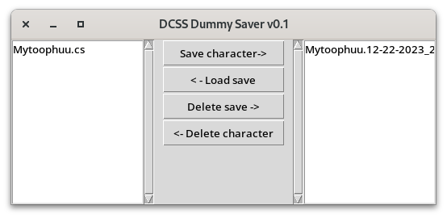

## Introduction
For GIT (Github) testing only! DCSS Saver is small Python GUI application to save your character in __Dungeon Crawl Stone Soup__ game! 

## Current Releases
__0.1__ - Initial commit. 
## Platforms
Tested on a Fedora Workstation 39. `Python3` required. `tkinter` library is preinstalled, I suppose.
## Usage
Just launch it!  
Typical launch:
> *python3 saver.py*

When you need to save your character's progress, close game, press on a character and then press `Save character`. It will be copied to saves directory. When you need to restore your character from save file (usually it happens when you die), do not press ESC after morgue message! Press `Load save` and press ESC in game. Voila! You can continue now.
## Plans
 - Read description from save file to know character's class, level, etc;
## Licenses
Use and modify on your own risk.